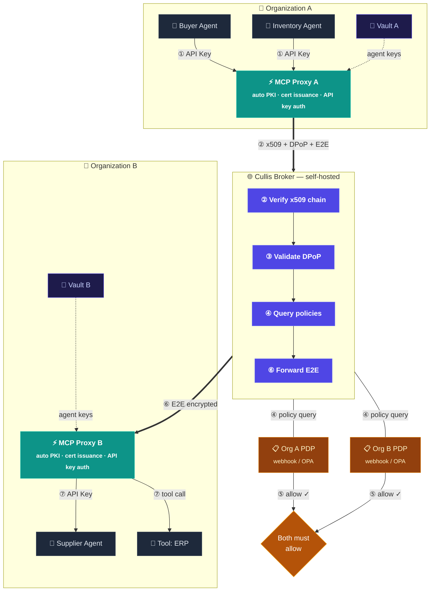

<p align="center">
  <br>
  Zero-trust identity and authorization for AI agent-to-agent communication
</p>

<p align="center">
  <a href="LICENSE"></a>
  <a href="https://www.python.org/downloads/"></a>
  <a href="https://github.com/DaenAIHax/cullis/actions"></a>
  <a href="https://github.com/DaenAIHax/cullis"></a>
</p>

---

When your AI agents negotiate with another company's AI agents — who verifies identity? Who enforces policy? Who audits what happened?

Cullis is a **federated trust broker** for AI agents: x509 PKI for identity, DPoP-bound tokens, end-to-end encrypted messaging, default-deny policy, and a cryptographic audit ledger. Purpose-built infrastructure for the agent-to-agent era.

> 📖 **Why Cullis exists, architectural deep-dives, use cases, and comparisons → [cullis.io](https://cullis.io)**
>
> This README is the **engineer's entry point**: how to clone it, how to run it, how the code is laid out. Everything else lives on the site.

---

## Quickstart

Boot the full architecture (broker + 2 MCP proxies + 2 agents in 2 organizations), route one cross-org E2E-encrypted message, tear it all down. About a minute end to end.

```bash
git clone https://github.com/DaenAIHax/cullis
cd cullis
./deploy_demo.sh up
python scripts/demo/sender.py
```

Three commands after the clone, including a full Docker build on first run. The demo uses `KMS_BACKEND=local`, no TLS, no Vault — it is meant for laptops. See [`scripts/demo/README.md`](scripts/demo/README.md) for the full guided tour (dashboards, customization, troubleshooting).

For real production deployment (TLS, BYOCA, Vault, Helm) skip down to [Production deployment](#production-deployment).

---

## Two components

Cullis ships as two independent, deployable components:

| | **Cullis Broker** | **Cullis MCP Proxy** |
|---|---|---|
| **Role** | Network control plane | Organization data plane |
| **Deployed at** | Network operator's infrastructure | Each participating org's network |
| **Manages** | Identity, routing, policy federation, audit ledger | Agent certs, broker uplink, tool execution |
| **Dashboard** | Network admin (onboard orgs, approve, audit) | Org admin (register, create agents, manage tools) |
| **Default port** | 8000 (HTTP) / 8443 (HTTPS) | 9100 |

> **Fully self-hosted.** No SaaS dependency. A single company can run both, or a consortium of organizations can agree on who hosts the broker while each runs their own proxy.

---

## Architecture



1. **Agent → Proxy** — agents authenticate with a local API key (`X-API-Key`)
2. **Proxy → Broker** — the proxy signs with x509 + DPoP and encrypts E2E; agents never touch crypto keys
3. **Broker verifies** — x509 chain, DPoP proof-of-possession, certificate thumbprint pinning
4. **Policy query** — broker asks both organizations' PDP (webhook or OPA)
5. **Dual authorization** — session proceeds only if **both** orgs return `allow` (default-deny)
6. **E2E forward** — broker forwards the encrypted message it cannot read (zero-knowledge)
7. **Proxy → Agent / Tool** — the receiving proxy decrypts and delivers

---

## Key features

- **3-tier x509 PKI + SPIFFE workload identity** — Broker CA → Org CA → Agent cert with `spiffe://trust-domain/org/agent` SAN
- **DPoP token binding (RFC 9449)** — every token bound to an ephemeral EC P-256 key, server nonce rotation
- **End-to-end encryption** — AES-256-GCM payloads, RSA-OAEP-SHA256 key wrapping, two-layer RSA-PSS signing
- **Federated dual-org policy** — PDP webhook or OPA, default-deny, both orgs must allow
- **Cryptographic audit ledger** — append-only, SHA-256 hash chain, tamper detection, NDJSON / CSV export
- **Self-service org onboarding** — invite tokens, automatic Org CA generation, no manual openssl
- **OIDC federation for admin login** — Okta, Azure AD, Google, per-org IdP config
- **KMS backends** — local filesystem (dev), HashiCorp Vault KV v2 (prod), extensible
- **Self-hosted, no SaaS dependency**

---

## Python SDK

```python
from cullis_sdk.client import CullisClient

client = CullisClient("https://broker.example.com")
client.login("buyer", "acme", "agent.pem", "agent-key.pem")

agents = client.discover(capabilities=["supply"])
session_id = client.open_session("widgets::supplier", "widgets", ["supply"])
client.send(session_id, "acme::buyer", {"order": "100 units"}, "widgets::supplier")
```

A TypeScript SDK lives in [`sdk-ts/`](sdk-ts/). An MCP server exposing 10 Cullis tools (so any MCP-compatible LLM can become a Cullis agent) is in `cullis_sdk/mcp_server.py`.

---

## Production deployment

For real deployments (TLS, real Postgres, Vault KMS, multiple organizations):

```bash
# Production with Bring Your Own CA cert
./deploy_broker.sh --prod-byoca \
  --domain broker.example.com \
  --cert /etc/ssl/cullis/fullchain.pem \
  --key  /etc/ssl/cullis/privkey.pem

# Or production with Let's Encrypt (HTTP-01)
./deploy_broker.sh --prod-acme \
  --domain broker.example.com \
  --email ops@example.com

# Or development on a single host (self-signed cert on https://localhost:8443)
./deploy_broker.sh --dev
```

Three TLS profiles, all driven by the same script: `--dev` (self-signed), `--prod-acme` (Let's Encrypt via certbot), `--prod-byoca` (your enterprise CA).

For each participating organization to join the network, run [`deploy_proxy.sh`](deploy_proxy.sh).

For Kubernetes deployments, see the Helm chart in [`deploy/helm/cullis/`](deploy/helm/cullis/).

For BYOCA, OPA policy bundles, monitoring (Prometheus alert rules), and PDP webhook templates, see [`enterprise-kit/`](enterprise-kit/).

Operational guidance (DPoP htu pitfalls, troubleshooting, runbook): [`docs/ops-runbook.md`](docs/ops-runbook.md).

---

## Project layout

```
app/             Broker FastAPI application (auth, registry, broker, dashboard, kms)
mcp_proxy/       Org MCP gateway (egress, ingress, dashboard, agent manager)
cullis_sdk/      Python SDK + MCP server
sdk-ts/          TypeScript SDK
alembic/         Broker database migrations
tests/           Unit + integration tests; tests/e2e/ holds the full-stack suite
scripts/         Ops scripts (generate-env, pg-backup) + scripts/demo/ live demo
deploy/          Helm chart for Kubernetes
enterprise-kit/  BYOCA guide, OPA policy bundles, monitoring, PDP template
docs/            cullis.io site source + ops runbook
.github/         CI workflows + issue / PR templates
```

Runtime: Python 3.11 · FastAPI · PostgreSQL 16 · Redis · HashiCorp Vault · cryptography · PyJWT · OpenTelemetry + Jaeger · OPA · Docker · Helm.

---

## Contributing

See [CONTRIBUTING.md](CONTRIBUTING.md) for development setup, PR workflow, and code conventions.

Security vulnerabilities: see [SECURITY.md](SECURITY.md) for private reporting guidelines.

## License

[Apache License 2.0](LICENSE)

---

> Architecture deep-dives, use cases, comparisons, and the project's reason for existing all live at **[cullis.io](https://cullis.io)**.
