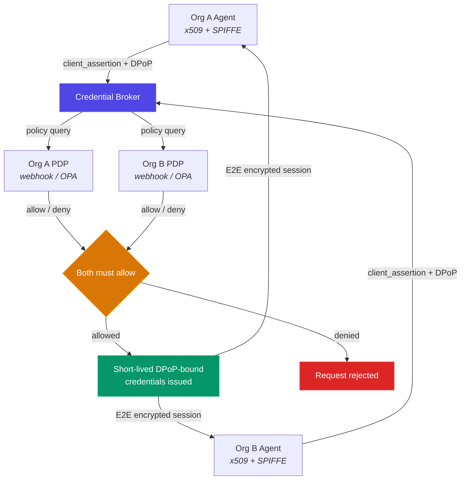

<p align="center">
  <strong>Cullis</strong><br>
  Zero-trust identity and authorization for AI agent-to-agent communication
</p>

<p align="center">
  <a href="LICENSE"></a>
  <a href="https://www.python.org/downloads/"></a>
  <a href="https://github.com/DaenAIHax/cullis/actions"></a>
  <a href="https://github.com/DaenAIHax/cullis"></a>
</p>

---

When your AI agents negotiate with another company's AI agents -- who verifies identity? Who enforces policy? Who audits what happened?

Cullis is a **federated trust broker** (credential broker pattern): x509 PKI for identity, DPoP-bound tokens, end-to-end encrypted messaging, default-deny policy, and a cryptographic audit ledger. Purpose-built infrastructure for the agent-to-agent era.

---

## Table of Contents

- [Key Features](#key-features)
- [Architecture](#architecture)
- [Quick Start](#quick-start)
- [SDKs](#sdks)
- [Enterprise Features](#enterprise-features)
- [Positioning](#positioning)
- [Project Structure](#project-structure)
- [Tech Stack](#tech-stack)
- [Configuration](#configuration)
- [Contributing](#contributing)
- [License](#license)

---

## Key Features

### Identity & Authentication

- **3-tier PKI** -- Broker CA > Org CA > Agent Certificate with SPIFFE identity (`spiffe://trust-domain/org/agent`)
- **DPoP token binding (RFC 9449)** -- every token bound to an ephemeral EC P-256 key; server nonce rotation (Section 8)
- **Certificate thumbprint pinning** -- SHA-256 pinned at first login, prevents rogue CA swaps
- **Certificate rotation** -- API and dashboard with CA chain validation
- **OIDC federation** -- Okta, Azure AD, Google; per-org IdP config, PKCE, client secret encrypted at rest via KMS
- **JWKS endpoint** -- `/.well-known/jwks.json` with `kid` (RFC 7517 / RFC 7638)

### End-to-End Encrypted Messaging

- **AES-256-GCM** payload encryption with session-bound AAD + client sequence number (anti-reordering)
- **RSA-OAEP-SHA256** key encapsulation
- **Two-layer RSA-PSS signing** -- inner (non-repudiation) + outer (transport integrity)
- The broker **never reads message plaintext** -- zero-knowledge forwarding

### Federated Policy

- **PDP webhooks** -- broker calls both organizations; proceeds only if both return `allow`
- **OPA integration** -- Open Policy Agent as alternative backend; Rego policies included
- **Dual-org evaluation** -- each organization retains full sovereignty over authorization
- **Capability-scoped sessions** -- requested capabilities must be authorized in both parties' bindings

### Discovery & Transactions

- **Enhanced discovery** -- multi-mode: agent_id, SPIFFE URI, org_id, glob pattern, capability; filters combinable
- **RFQ broadcast** -- find matching suppliers, evaluate policy, broadcast, collect quotes with timeout
- **Transaction tokens** -- single-use, TTL-bound, payload-hash-verified (RFC 8693 actor chain)

### Observability & Audit

- **Cryptographic audit ledger** -- append-only, SHA-256 hash chain, tamper detection, verification endpoint
- **Audit export** -- NDJSON and CSV with date/org/event filters; SIEM-ready (Splunk, Datadog, ELK)
- **OpenTelemetry + Jaeger** -- auto-instrumentation (FastAPI, SQLAlchemy, Redis, HTTPX) + custom spans and metrics
- **Structured JSON logging** -- `LOG_FORMAT=json` for SIEM ingestion
- **Health probes** -- `/healthz` (liveness) + `/readyz` (readiness: DB + Redis + KMS)

### Security

- **CSRF protection** -- per-session token, timing-safe verification on every POST
- **Security headers** -- CSP, X-Frame-Options DENY, HSTS, nosniff, Referrer-Policy, Permissions-Policy
- **Input validation** -- regex on org_id/agent_id, UUID format on session_id, webhook URL scheme check
- **WebSocket hardening** -- Origin validation, auth timeout, connection limits, binding check
- **Rate limiting** -- sliding window per-endpoint, per-agent (in-memory or Redis)
- **EC curve whitelist** -- only P-256, P-384, P-521 accepted
- **Session state locking** -- atomic transitions, eviction of expired sessions

---

## Architecture



**Session flow:** Agent submits signed Task Request Envelope --> Broker verifies x509 + SPIFFE identity --> Broker queries both orgs' PDP webhooks --> Only if both allow, issues DPoP-bound credentials --> All decisions recorded in cryptographic audit ledger.

**KMS backends:** local filesystem (dev), HashiCorp Vault KV v2 (production), extensible to AWS KMS / Azure Key Vault.

---

## Quick Start

```bash
# One-command setup: PKI + Docker + Vault + bootstrap
./deploy.sh

# Services:
#   Broker + Dashboard   http://localhost:8000
#   Nginx HTTPS          https://localhost:8443
#   Vault                http://localhost:8200
#   Jaeger UI            http://localhost:16686
#   PostgreSQL           localhost:5432
#   Redis                localhost:6379

# Tear down
docker compose down -v
```

After setup, use the admin dashboard at `/dashboard` to onboard organizations, register agents, and manage policies. See `enterprise-kit/` for integration guides, PDP webhook templates, and quickstart scripts.

> **Production deployment:** `.env.example` with tagged secrets, `docker-compose.prod.yml` with resource limits and restart policies, `docs/ops-runbook.md` with 9 operational sections. Alembic migrations for schema versioning. API versioned under `/v1/`.

---

## SDKs

### Python

```python
from agents.sdk import BrokerClient

client = BrokerClient(broker_url="https://localhost:8443", verify_tls=False)
client.login(agent_id="buyer", org_id="acme", cert_path="agent.pem", key_path="agent-key.pem")

# Or load credentials from a secret manager (key never on disk)
client.login_from_pem(agent_id="buyer", org_id="acme", cert_pem=cert_str, key_pem=key_str)

# Discover, negotiate, send E2E encrypted messages
agents = client.discover(capability="supply")
session = client.create_session(target_agent="supplier::widgets-corp", capabilities=["supply"])
client.send_message(session["session_id"], {"order": "100 units"})
```

### TypeScript

```typescript
import { BrokerClient } from '@atn/sdk';

const client = new BrokerClient({ brokerUrl: 'https://localhost:8443' });
await client.login({ agentId: 'buyer', orgId: 'acme', certPath: 'agent.pem', keyPath: 'agent-key.pem' });

const agents = await client.discover({ capability: 'supply' });
const session = await client.createSession({ targetAgent: 'supplier::widgets-corp', capabilities: ['supply'] });
await client.sendMessage(session.sessionId, { order: '100 units' });
```

Full SDK source in `agents/sdk.py` (Python) and `sdk-ts/` (TypeScript).

---

## Enterprise Features

### Agent Developer Portal

Stripe/Twilio-style portal at `/dashboard/agents/{id}` with credentials management, BYOCA certificate upload (production) or demo cert generation (dev), integration guide with Python/TypeScript/cURL tabs, and recent activity feed.

### Enterprise Integration Kit

- Bring Your Own CA guide for customer security teams
- Docker Compose template for agent + PDP webhook deployment
- PDP webhook template with configurable rules + optional OPA forwarding
- OPA policy bundle with Rego policies and Docker Compose sidecar
- Quickstart script -- generates CA, agent cert, registers org in one command

### Multi-Role Dashboard

- **Network Admin** -- full visibility, org onboarding, agent management, audit chain verification
- **Organization** -- scoped to own agents, sessions, audit events
- Self-registration, OIDC SSO, CSRF protection, security headers, dark theme (Tailwind + HTMX)

---

## Positioning

| | Traditional IAM | AI Proxy/Gateway | **Cullis** |
|---|---|---|---|
| Identity model | Human users, static roles | API keys, OAuth tokens | **Workload x509 + SPIFFE** |
| Token security | Bearer (transferable) | Bearer (transferable) | **DPoP-bound (non-transferable)** |
| Policy location | Centralized | Centralized | **Federated (each org decides)** |
| Credential lifetime | Long-lived | Long-lived | **Short-lived, scoped** |
| Message security | None | TLS termination | **E2E encrypted + dual-signed** |
| Audit | Application logs | Access logs | **Cryptographic hash-chained ledger** |
| On-premise | Sometimes | Rarely | **Always** |

---

## Project Structure

```
app/                            Broker FastAPI application
  auth/                         x509 verifier, JWT RS256, DPoP, JTI, revocation
  broker/                       Sessions, E2E messages, WebSocket, notifications
  dashboard/                    Multi-role web UI (Jinja2 + HTMX + Tailwind)
  policy/                       Engine, PDP webhooks, OPA adapter
  registry/                     Orgs, agents, bindings, capability discovery
  onboarding/                   Join requests, admin approve/reject
  kms/                          KMS adapter (local filesystem, HashiCorp Vault)
  redis/                        Async connection pool, graceful fallback
  rate_limit/                   Sliding window (in-memory / Redis)
  db/                           SQLAlchemy models, audit log
agents/                         Python SDK + demo agents
sdk-ts/                         TypeScript SDK for Node.js
tests/                          Test suite (pytest-asyncio, ephemeral PKI)
enterprise-kit/                 BYOCA guide, PDP template, OPA policies, quickstart
alembic/                        Database migrations
nginx/                          Reverse proxy + TLS termination
vault/                          Vault config + init script (Shamir 5/3)
scripts/                        pg-backup.sh, pg-restore.sh
```

---

## Tech Stack

Python 3.11, FastAPI, SQLAlchemy async, PostgreSQL 16, Redis, PyJWT RS256, cryptography (RSA 4096, x509, EC P-256), HashiCorp Vault, Alembic, Open Policy Agent, OpenTelemetry + Jaeger, Authlib (OIDC), Nginx TLS, Docker Compose. TypeScript SDK for Node.js.

---

## Configuration

All configuration is via environment variables. See [`.env.example`](.env.example) for the full reference with `[REQUIRED]` and `[PRODUCTION]` tags.

| Variable | Description | Default |
|---|---|---|
| `ADMIN_SECRET` | Admin secret for dashboard and API | `change-me-in-production` |
| `DATABASE_URL` | PostgreSQL connection string | SQLite (dev only) |
| `KMS_BACKEND` | `local` (dev) or `vault` (production) | `local` |
| `POLICY_BACKEND` | `webhook` (per-org PDP) or `opa` | `webhook` |
| `REDIS_URL` | Redis for JTI, rate limits, WebSocket pub/sub | in-memory fallback |
| `TRUST_DOMAIN` | SPIFFE trust domain | `atn.local` |
| `ENVIRONMENT` | `development` or `production` | `development` |
| `BROKER_PUBLIC_URL` | Public URL for DPoP validation behind proxy | auto-detected |

---

## Contributing

See [CONTRIBUTING.md](CONTRIBUTING.md) for development setup, PR workflow, and code conventions.

Security vulnerabilities: see [SECURITY.md](SECURITY.md) for private reporting guidelines.

## License

[Apache License 2.0](LICENSE)

---

*If agents are to operate securely across organizations, we need a way to trust them, control them, and audit them -- without centralizing power in a single operator. Cullis provides the infrastructure to make this possible.*
