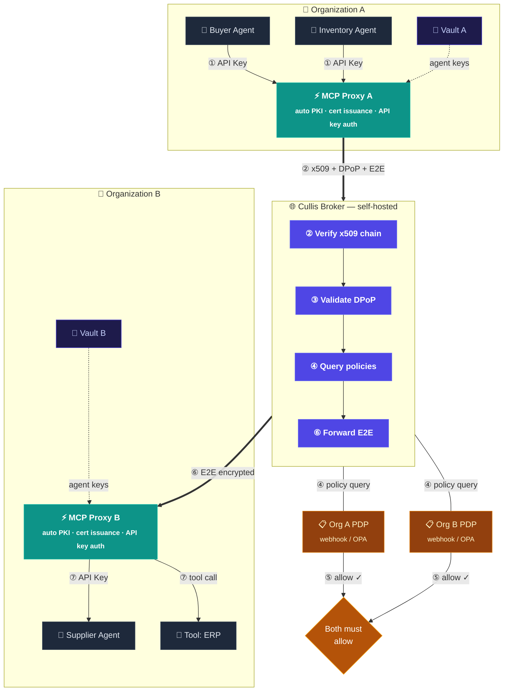

<p align="center">
  <br>
  Zero-trust identity and authorization for AI agent-to-agent communication
</p>

<p align="center">
  <a href="LICENSE"></a>
  <a href="https://www.python.org/downloads/"></a>
  <a href="https://github.com/cullis-security/cullis/actions"></a>
  <a href="https://github.com/cullis-security/cullis"></a>
  <a href="#status"></a>
</p>

---

> [!WARNING]
> **Early-stage research project — not production-ready.**
>
> Cullis is in active study and prototyping. The architecture is real and the demo runs end-to-end on a laptop, but the codebase has **not** been hardened, security-audited, or validated against real production workloads. Several components are still exploratory and APIs may break without notice.
>
> **Use it to learn, explore, prototype, and contribute — not to handle real users, real credentials, or real traffic yet.**
>
> Feedback, security reviews, and ideas are very welcome — see [Contact](#contact).

---

## Status

This is a **research and learning project** built in the open. The goals right now are: (1) explore what cryptographic identity, federated authorization, and tamper-evident audit look like for cross-organization AI agents; (2) prototype an architecture that composes existing standards (x509, SPIFFE, DPoP, OAuth 2.0, OPA) into something coherent for the agent era; (3) get the design reviewed by security researchers and the workload-identity community.

What this means in practice:

- **The demo (`./deploy_demo.sh`)** is the only end-to-end path covered by automated tests. Use it to explore the architecture.
- **The Helm chart** is exploratory — no SLA, no upgrade path, no migration story yet.
- **No security review yet.** The codebase has gone through internal audit rounds but never independent third-party review.
- **Schema and APIs may break.** Pre-1.0, no semver guarantees.

If you want to **try it**, the demo is the right entry point. If you want to **review or break it**, see [SECURITY.md](SECURITY.md). If you want to **deploy it for real workloads** — please don't, not yet.

---

When your AI agents negotiate with another company's AI agents — who verifies identity? Who enforces policy? Who audits what happened?

Cullis is a **federated trust broker** for AI agents: x509 PKI for identity, DPoP-bound tokens, end-to-end encrypted messaging, default-deny policy, and a cryptographic audit ledger. Purpose-built infrastructure for the agent-to-agent era.

> 📖 **Why Cullis exists, architectural deep-dives, use cases, and comparisons → [cullis.io](https://cullis.io)**
>
> This README is the **engineer's entry point**: how to clone it, how to run it, how the code is laid out. Everything else lives on the site.

---

## Quickstart

Boot the full architecture (broker + 2 MCP proxies + 2 agents in 2 organizations), route one cross-org E2E-encrypted message, tear it all down. About a minute end to end.

### What you need

| Requirement                                          | Why                                                                  |
|------------------------------------------------------|----------------------------------------------------------------------|
| **Docker Engine** with the **Compose v2** plugin     | The demo runs five containers (broker, 2 MCP proxies, postgres, redis) |
| **Python 3.10+** on the host                         | The orchestrator + sender + checker scripts run on the host, not in containers |
| **`httpx`** + **`cryptography`** Python packages     | Host-side dependencies (orchestrator + broker CA generation)         |
| Free TCP ports **8800**, **9800**, **9801**          | The script fails fast with a clear message if any of them is taken   |
| ~2 GB free disk + outbound network                   | First-time build pulls the broker + proxy images                     |

Supported hosts: Linux native, macOS with Docker Desktop / OrbStack / Colima, Windows via WSL2 + Docker Desktop. No Nix required (Nix is only used by the maintainer's dev loop).

### Run it

```bash
git clone https://github.com/cullis-security/cullis
cd cullis
python3 -m venv .venv
.venv/bin/pip install httpx cryptography
./deploy_demo.sh up
./deploy_demo.sh send
```

The wrapper auto-detects `.venv/bin/python`, no need to activate it. Six commands from zero to a running federated trust network, including a full Docker build on first run. See [`scripts/demo/README.md`](scripts/demo/README.md) for the full guided tour (dashboards, customization, troubleshooting).

<details>
<summary>Ubuntu Server 24.04 (fresh install) — extra step</summary>

Ubuntu Server does not ship `pip` or `venv` out of the box and has no `python` alias (only `python3`). Run this before the commands above:

```bash
sudo apt update && sudo apt install -y python3-pip python3-venv
```

</details>

> [!CAUTION]
> **The demo deliberately disables production security features to let you explore the routing and architecture with two simple scripts.**
>
> What is **OFF** in the demo:
>
> | Security layer | Demo | Production |
> |---|---|---|
> | **TLS / HTTPS** | Plain HTTP | nginx + TLS certificates (self-signed, ACME, or BYOCA) |
> | **KMS** | Filesystem (`KMS_BACKEND=local`) — keys on disk | HashiCorp Vault KV v2 (encrypted, access-controlled) |
> | **Admin secrets** | Hardcoded in compose file (`cullis-demo-admin-secret`) | Strong random, rotated, from secrets manager |
> | **SSRF protection** | Bypassed (`POLICY_WEBHOOK_ALLOW_PRIVATE_IPS=true`) | Enforced — webhooks cannot hit private IPs |
> | **OIDC admin login** | Disabled — password-only | Okta / Azure AD / Google federation |
> | **Observability** | Off (`OTEL_ENABLED=false`) | OpenTelemetry + Jaeger traces + Prometheus metrics |
> | **CORS** | `*` (all origins) | Specific allowed origins |
> | **Cookie security** | `secure=False` (HTTP) | `secure=True` (HTTPS only) |
> | **SPIFFE SAN validation** | Not enforced | `REQUIRE_SPIFFE_SAN=true` |
> | **Certificate chain validation** | Not enforced | `REQUIRE_CERT_VALIDATION=true` |
> | **Workers** | 1 (single process) | Multiple workers + Redis for distributed state |
>
> **What the demo DOES show:** the full routing flow (agent → proxy → broker → proxy → agent), E2E encryption, DPoP token binding, dual-org policy evaluation, and the dashboard. Everything that makes the architecture work is real — everything that makes it safe for production is off.
>
> **Do not expose demo ports outside localhost. Do not use demo credentials anywhere.**

---

## Two components

Cullis ships as two independent, deployable components:

| | **Cullis Broker** | **Cullis MCP Proxy** |
|---|---|---|
| **Role** | Network control plane | Organization data plane |
| **Deployed at** | Network operator's infrastructure | Each participating org's network |
| **Manages** | Identity, routing, policy federation, audit ledger | Agent certs, broker uplink, tool execution |
| **Dashboard** | Network admin (onboard orgs, approve, audit) | Org admin (register, create agents, manage tools) |
| **Default port** | 8000 (HTTP) / 8443 (HTTPS) | 9100 |

> **Fully self-hosted.** No SaaS dependency. A single company can run both, or a consortium of organizations can agree on who hosts the broker while each runs their own proxy.

---

## Architecture



1. **Agent → Proxy** — agents authenticate with a local API key (`X-API-Key`)
2. **Proxy → Broker** — the proxy signs with x509 + DPoP and encrypts E2E; agents never touch crypto keys
3. **Broker verifies** — x509 chain, DPoP proof-of-possession, certificate thumbprint pinning
4. **Policy query** — broker asks both organizations' PDP (webhook or OPA)
5. **Dual authorization** — session proceeds only if **both** orgs return `allow` (default-deny)
6. **E2E forward** — broker forwards the encrypted message it cannot read (zero-knowledge)
7. **Proxy → Agent / Tool** — the receiving proxy decrypts and delivers

---

## Key features

- **3-tier x509 PKI + SPIFFE workload identity** — Broker CA → Org CA → Agent cert with `spiffe://trust-domain/org/agent` SAN
- **DPoP token binding (RFC 9449)** — every token bound to an ephemeral EC P-256 key, server nonce rotation
- **End-to-end encryption** — AES-256-GCM payloads, RSA-OAEP-SHA256 key wrapping, two-layer RSA-PSS signing
- **Federated dual-org policy** — PDP webhook or OPA, default-deny, both orgs must allow
- **Cryptographic audit ledger** — append-only, SHA-256 hash chain, tamper detection, NDJSON / CSV export
- **Self-service org onboarding** — invite tokens, automatic Org CA generation, no manual openssl
- **OIDC federation for admin login** — Okta, Azure AD, Google, per-org IdP config
- **KMS backends** — local filesystem (dev), HashiCorp Vault KV v2 (prod), extensible
- **Self-hosted, no SaaS dependency**

---

## Python SDK

```python
from cullis_sdk.client import CullisClient

client = CullisClient("https://broker.example.com")
client.login("buyer", "acme", "agent.pem", "agent-key.pem")

agents = client.discover(capabilities=["supply"])
session_id = client.open_session("widgets::supplier", "widgets", ["supply"])
client.send(session_id, "acme::buyer", {"order": "100 units"}, "widgets::supplier")
```

A TypeScript SDK lives in [`sdk-ts/`](sdk-ts/). An MCP server exposing 10 Cullis tools (so any MCP-compatible LLM can become a Cullis agent) is in `cullis_sdk/mcp_server.py`.

---

## Project layout

```
app/             Broker FastAPI application (auth, registry, broker, dashboard, kms)
mcp_proxy/       Org MCP gateway (egress, ingress, dashboard, agent manager)
cullis_sdk/      Python SDK + MCP server
sdk-ts/          TypeScript SDK
alembic/         Broker database migrations
tests/           Unit + integration tests; tests/e2e/ holds the full-stack suite
scripts/         Ops scripts (generate-env, pg-backup) + scripts/demo/ live demo
deploy/          Helm chart for Kubernetes
enterprise-kit/  BYOCA guide, OPA policy bundles, monitoring, PDP template
docs/            cullis.io site source + ops runbook
.github/         CI workflows + issue / PR templates
```

Runtime: Python 3.11 · FastAPI · PostgreSQL 16 · Redis · HashiCorp Vault · cryptography · PyJWT · OpenTelemetry + Jaeger · OPA · Docker · Helm.

---

## Contributing

See [CONTRIBUTING.md](CONTRIBUTING.md) for development setup, PR workflow, and code conventions.

Security vulnerabilities: see [SECURITY.md](SECURITY.md) for private reporting guidelines.

## Contact

| | |
|---|---|
| General questions, partnerships, demos | **[hello@cullis.io](mailto:hello@cullis.io)** |
| Security vulnerabilities (private)     | **[security@cullis.io](mailto:security@cullis.io)** &middot; see [SECURITY.md](SECURITY.md) |
| Bug reports, feature requests          | [GitHub Issues](https://github.com/cullis-security/cullis/issues) |
| Discussion, questions, ideas           | [GitHub Discussions](https://github.com/cullis-security/cullis/discussions) |

## License

[Apache License 2.0](LICENSE)

---

> Architecture deep-dives, use cases, comparisons, and the project's reason for existing all live at **[cullis.io](https://cullis.io)**.
