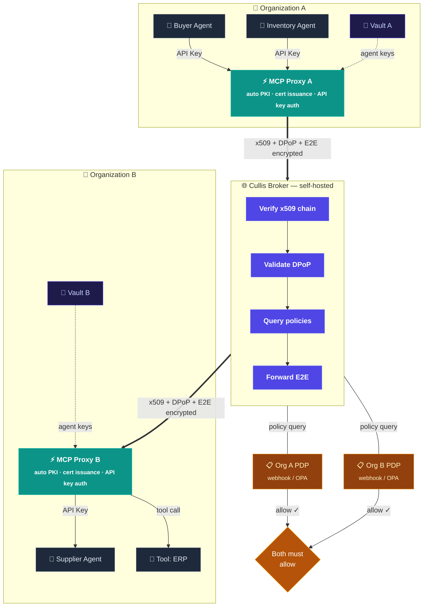

<p align="center">
  <br>
  Zero-trust identity and authorization for AI agent-to-agent communication
</p>

<p align="center">
  <a href="LICENSE"></a>
  <a href="https://www.python.org/downloads/"></a>
  <a href="https://github.com/DaenAIHax/cullis/actions"></a>
  <a href="https://github.com/DaenAIHax/cullis"></a>
</p>

---

When your AI agents negotiate with another company's AI agents -- who verifies identity? Who enforces policy? Who audits what happened?

Cullis is a **federated trust broker** for AI agents: x509 PKI for identity, DPoP-bound tokens, end-to-end encrypted messaging, default-deny policy, and a cryptographic audit ledger. Purpose-built infrastructure for the agent-to-agent era.

---

## Table of Contents

- [Two Components](#two-components)
- [Key Features](#key-features)
- [Architecture](#architecture)
- [Quick Start](#quick-start)
- [MCP Proxy](#mcp-proxy)
- [SDKs](#sdks)
- [Enterprise Features](#enterprise-features)
- [Positioning](#positioning)
- [Project Structure](#project-structure)
- [Tech Stack](#tech-stack)
- [Configuration](#configuration)
- [Contributing](#contributing)
- [License](#license)

---

## Two Components

Cullis ships as **two independent, deployable components**:

| | **Cullis Broker** | **Cullis MCP Proxy** |
|---|---|---|
| **Role** | Network control plane | Organization data plane |
| **Deploys at** | Your infrastructure (self-hosted) | Each participating organization's network |
| **Manages** | Identity, routing, policy federation, audit | Agent certs, tool execution, broker communication |
| **Dashboard** | Network admin (onboard orgs, approve, audit) | Org admin (register, create agents, manage tools) |
| **Port** | 8000 (HTTP) / 8443 (HTTPS) | 9100 |

> **Fully self-hosted.** Both components run on your own infrastructure. There is no SaaS dependency. A single company can run both the broker and proxies internally, or a consortium of organizations can agree on who hosts the broker while each runs their own proxy.

```
                    ┌──────────────────────┐
                    │    Cullis Broker      │
                    │  (trust network hub)  │
                    └──────────┬───────────┘
                   ┌───────────┴───────────┐
            ┌──────┴──────┐         ┌──────┴──────┐
            │  MCP Proxy  │         │  MCP Proxy  │
            │   (Org A)   │         │   (Org B)   │
            └──┬───┬───┬──┘         └──┬───┬───┬──┘
             Agent Agent Agent      Agent Agent Tool
             (API Key auth)         (API Key auth)
```

The **Broker** is the neutral hub -- self-hosted by the network operator (a single company, a consortium, or an industry body). It verifies identities, routes messages, enforces dual-org policy, and maintains the audit ledger. It never reads message content (zero-knowledge forwarding).

The **MCP Proxy** is each organization's gateway -- deployed in their own network. It handles x509 certificate generation, Vault key storage, and broker authentication **on behalf of internal agents**. Developers just use a local API key; the proxy handles all the cryptography.

---

## Key Features

### Identity & Authentication

- **3-tier PKI** -- Broker CA > Org CA > Agent Certificate with SPIFFE identity (`spiffe://trust-domain/org/agent`)
- **DPoP token binding (RFC 9449)** -- every token bound to an ephemeral EC P-256 key; server nonce rotation (Section 8)
- **Invite-based onboarding** -- broker admin generates one-time invite tokens; orgs join via MCP Proxy dashboard
- **Automatic certificate issuance** -- MCP Proxy auto-generates Org CA and agent certs (no manual openssl)
- **Certificate thumbprint pinning** -- SHA-256 pinned at first login, prevents rogue CA swaps
- **OIDC federation** -- Okta, Azure AD, Google; per-org IdP config, PKCE, client secret encrypted at rest via KMS
- **JWKS endpoint** -- `/.well-known/jwks.json` with `kid` (RFC 7517 / RFC 7638)

### End-to-End Encrypted Messaging

- **AES-256-GCM** payload encryption with session-bound AAD + client sequence number (anti-reordering)
- **RSA-OAEP-SHA256** key encapsulation
- **Two-layer RSA-PSS signing** -- inner (non-repudiation) + outer (transport integrity)
- The broker **never reads message plaintext** -- zero-knowledge forwarding

### Federated Policy

- **PDP webhooks** -- broker calls both organizations; proceeds only if both return `allow`
- **OPA integration** -- Open Policy Agent as alternative backend; Rego policies included
- **Dual-org evaluation** -- each organization retains full sovereignty over authorization
- **Capability-scoped sessions** -- requested capabilities must be authorized in both parties' bindings

### Discovery & Transactions

- **Enhanced discovery** -- multi-mode: agent_id, SPIFFE URI, org_id, glob pattern, capability; filters combinable
- **RFQ broadcast** -- find matching suppliers, evaluate policy, broadcast, collect quotes with timeout
- **Transaction tokens** -- single-use, TTL-bound, payload-hash-verified (RFC 8693 actor chain)

### Observability & Audit

- **Cryptographic audit ledger** -- append-only, SHA-256 hash chain, tamper detection, verification endpoint
- **Audit export** -- NDJSON and CSV with date/org/event filters; SIEM-ready (Splunk, Datadog, ELK)
- **OpenTelemetry + Jaeger** -- auto-instrumentation (FastAPI, SQLAlchemy, Redis, HTTPX) + custom spans and metrics
- **Structured JSON logging** -- `LOG_FORMAT=json` for SIEM ingestion
- **Health probes** -- `/healthz` (liveness) + `/readyz` (readiness: DB + Redis + KMS)

### Security

- **CSRF protection** -- per-session token, timing-safe verification on every POST
- **Security headers** -- CSP, X-Frame-Options DENY, HSTS, nosniff, Referrer-Policy, Permissions-Policy
- **Input validation** -- regex on org_id/agent_id, UUID format on session_id, webhook URL scheme check
- **WebSocket hardening** -- Origin validation, auth timeout, connection limits, binding check
- **Rate limiting** -- sliding window per-endpoint, per-agent (in-memory or Redis)
- **Domain whitelist** -- MCP Proxy enforces allowed domains per tool (SSRF prevention)

---

## Architecture



### How it works

1. **Agents talk to their local MCP Proxy** using simple API keys -- no certificates, no DPoP, no cryptography
2. **The Proxy handles everything** -- x509 cert issuance, DPoP token binding, E2E encryption, Vault key storage
3. **The Broker routes and enforces** -- verifies identity, queries both orgs' policy engines, forwards encrypted messages it cannot read
4. **Each org controls its own policy** -- PDP webhook or OPA; the broker enforces both decisions (default-deny)

**KMS backends:** local filesystem (dev), HashiCorp Vault KV v2 (production), extensible to AWS KMS / Azure Key Vault.

---

## Quick Start

### 1. Deploy the Broker

```bash
# One-command setup: PKI + Docker + Vault + bootstrap
./deploy.sh --dev

# Services:
#   Broker + Dashboard   http://localhost:8000
#   Nginx HTTPS          https://localhost:8443
#   Vault                http://localhost:8200
#   Jaeger UI            http://localhost:16686
```

### 2. Deploy the MCP Proxy

```bash
# Standalone Docker
docker compose -f docker-compose.proxy.yml up -d

# Or run locally
PYTHONPATH=. uvicorn mcp_proxy.main:app --port 9100 --reload
```

### 3. Connect and Register

1. Open the **Broker dashboard** at `http://localhost:8000/dashboard` -- log in with the admin secret from `.env`
2. Go to **Organizations** → **Generate Invite Token** -- copy the token
3. Open the **MCP Proxy dashboard** at `http://localhost:9100/proxy/login`
4. Enter the **Broker URL** (`http://localhost:8000`) and the **Invite Token**
5. **Register your organization** -- the proxy auto-generates a Certificate Authority
6. Back in the Broker dashboard, **approve** the pending organization
7. In the Proxy dashboard, **create agents** -- each gets an x509 cert + local API key

No manual certificate generation. No openssl commands. No bootstrap scripts.

---

## MCP Proxy

The MCP Proxy is the **org-level enterprise gateway**. It replaces manual certificate management with a self-service dashboard.

### What It Handles

| Before (manual) | After (MCP Proxy) |
|---|---|
| `openssl genrsa` + `openssl req` + `openssl x509` | One click in the dashboard |
| Copy PEM files to every agent | Agents get a local API key |
| Manual broker registration API calls | Dashboard handles it automatically |
| Store keys in Vault manually | Proxy stores keys in Vault for you |

### Endpoints

| Path | Auth | Purpose |
|---|---|---|
| `POST /v1/ingress/execute` | JWT + DPoP | Execute a local tool (cross-org inbound) |
| `GET /v1/ingress/tools` | JWT + DPoP | List available tools |
| `POST /v1/egress/sessions` | API Key | Open broker session |
| `POST /v1/egress/send` | API Key | Send E2E encrypted message |
| `POST /v1/egress/discover` | API Key | Discover remote agents |
| `POST /v1/egress/tools/invoke` | API Key | Invoke remote tool via broker |
| `/proxy/*` | Session cookie | Dashboard UI |

### Dashboard Pages

- **Login** -- Broker URL + invite token
- **Register Organization** -- auto-generates CA, registers with broker
- **Agents** -- create, deactivate, delete; each gets x509 cert + API key
- **PKI** -- CA overview, export certificate, rotate CA
- **Vault** -- configure HashiCorp Vault, migrate keys
- **Tools** -- view registered tools, reload from YAML
- **Policies** -- built-in rules editor + external PDP webhook
- **Audit** -- filterable, paginated audit log

---

## SDKs

### Python SDK

```python
from cullis_sdk.client import CullisClient

client = CullisClient("https://broker.example.com")
client.login("buyer", "acme", "agent.pem", "agent-key.pem")

# Or via MCP Proxy (recommended -- no certs needed):
# curl -X POST http://proxy:9100/v1/egress/sessions \
#   -H "X-API-Key: sk_local_buyer_..." \
#   -d '{"target_agent_id": "widgets::supplier", ...}'

agents = client.discover(capabilities=["supply"])
session_id = client.open_session("widgets::supplier", "widgets", ["supply"])
client.send(session_id, "acme::buyer", {"order": "100 units"}, "widgets::supplier")
```

### MCP Server (for Claude, LLMs)

```bash
# Any MCP-compatible LLM can become a Cullis agent
python -m cullis_sdk.mcp_server
```

10 tools: `cullis_connect`, `cullis_discover`, `cullis_open_session`, `cullis_send`, `cullis_check_responses`, `cullis_check_pending`, `cullis_accept_session`, `cullis_close_session`, `cullis_list_sessions`, `cullis_select_session`.

### TypeScript SDK

Full SDK in `sdk-ts/` -- BrokerClient with login, discover, sessions, E2E send, RFQ, transaction tokens.

---

## Enterprise Features

### Invite-Based Onboarding

Broker admins generate one-time invite tokens. Organizations use them to register via the MCP Proxy dashboard. No open registration -- every org is explicitly invited.

### Automatic PKI

The MCP Proxy generates Org CA (RSA-4096, 10-year validity) and agent certificates (RSA-2048, SPIFFE SAN, 1-year validity) automatically. Private keys are stored in Vault or the local encrypted database.

### Enterprise Integration Kit

- Bring Your Own CA guide for customer security teams (`enterprise-kit/BYOCA.md`)
- PDP webhook template with configurable rules + optional OPA forwarding
- OPA policy bundle with Rego policies and Docker Compose sidecar
- Docker Compose templates for agent deployment

### Multi-Role Dashboards

- **Broker Dashboard** (network admin) -- org onboarding, invite management, agent registry, audit chain verification, Jaeger traces
- **Proxy Dashboard** (org admin) -- agent lifecycle, PKI management, Vault configuration, tool registry, local audit log

---

## Positioning

| | Traditional IAM | AI Proxy/Gateway | **Cullis** |
|---|---|---|---|
| Identity model | Human users, static roles | API keys, OAuth tokens | **Workload x509 + SPIFFE** |
| Token security | Bearer (transferable) | Bearer (transferable) | **DPoP-bound (non-transferable)** |
| Policy location | Centralized | Centralized | **Federated (each org decides)** |
| Credential lifetime | Long-lived | Long-lived | **Short-lived, scoped** |
| Message security | None | TLS termination | **E2E encrypted + dual-signed** |
| Audit | Application logs | Access logs | **Cryptographic hash-chained ledger** |
| Agent onboarding | Manual provisioning | API key generation | **Self-service dashboard + auto PKI** |
| Deployment | Cloud-only or hybrid | Cloud-only | **Fully self-hosted, no SaaS** |

---

## Project Structure

```
app/                            Broker FastAPI application
  auth/                         x509 verifier, JWT RS256, DPoP, JTI, revocation
  broker/                       Sessions, E2E messages, WebSocket, notifications
  dashboard/                    Broker admin web UI (Jinja2 + HTMX + Tailwind)
  policy/                       Engine, PDP webhooks, OPA adapter
  registry/                     Orgs, agents, bindings, capability discovery
  onboarding/                   Join requests, invite tokens, admin approve/reject
  kms/                          KMS adapter (local filesystem, HashiCorp Vault)

mcp_proxy/                      MCP Proxy — standalone org gateway
  auth/                         DPoP, JWT validation, JWKS client, API key auth
  ingress/                      Inbound tool execution (JWT+DPoP authenticated)
  egress/                       Outbound broker communication (API key authenticated)
  tools/                        Tool registry, executor, domain whitelist, secrets
  dashboard/                    Org admin web UI (register, agents, PKI, Vault, audit)
  db.py                         SQLite async (agents, audit, config)

cullis_sdk/                     Python SDK + MCP server
sdk-ts/                         TypeScript SDK for Node.js
tests/                          Test suite (pytest-asyncio, ephemeral PKI)
enterprise-kit/                 BYOCA guide, PDP template, OPA policies
alembic/                        Database migrations
```

---

## Tech Stack

**Broker:** Python 3.11, FastAPI, SQLAlchemy async, PostgreSQL 16, Redis, PyJWT RS256, cryptography (RSA 4096, x509, EC P-256), HashiCorp Vault, Alembic, Open Policy Agent, OpenTelemetry + Jaeger, Authlib (OIDC), Nginx TLS, Docker Compose.

**MCP Proxy:** Python 3.11, FastAPI, aiosqlite, httpx, cryptography, bcrypt, PyJWT, Jinja2 + HTMX + Tailwind. Zero external database dependencies.

**SDKs:** Python (cullis_sdk), TypeScript (sdk-ts), MCP server (stdio transport).

---

## Configuration

### Broker

All configuration via environment variables. See [`.env.example`](.env.example) for the full reference.

| Variable | Description | Default |
|---|---|---|
| `ADMIN_SECRET` | Admin secret for dashboard and API | `change-me-in-production` |
| `DATABASE_URL` | PostgreSQL connection string | SQLite (dev only) |
| `KMS_BACKEND` | `local` (dev) or `vault` (production) | `local` |
| `POLICY_BACKEND` | `webhook` (per-org PDP) or `opa` | `webhook` |
| `REDIS_URL` | Redis for JTI, rate limits, WebSocket pub/sub | in-memory fallback |
| `BROKER_PUBLIC_URL` | Public URL for DPoP validation behind proxy | auto-detected |

### MCP Proxy

Configuration via `proxy.env` file or `MCP_PROXY_` prefixed environment variables.

| Variable | Description | Default |
|---|---|---|
| `MCP_PROXY_DATABASE_URL` | SQLite path | `sqlite+aiosqlite:///./mcp_proxy.db` |
| `MCP_PROXY_SECRET_BACKEND` | `env` or `vault` | `env` |
| `MCP_PROXY_VAULT_ADDR` | Vault address | (empty) |
| `MCP_PROXY_PORT` | Listen port | `9100` |
| `MCP_PROXY_ENVIRONMENT` | `development` or `production` | `development` |

---

## Contributing

See [CONTRIBUTING.md](CONTRIBUTING.md) for development setup, PR workflow, and code conventions.

Security vulnerabilities: see [SECURITY.md](SECURITY.md) for private reporting guidelines.

## License

[Apache License 2.0](LICENSE)

---

*If agents are to operate securely across organizations, we need infrastructure to trust them, control them, and audit them -- fully self-hosted, without dependence on any external service. Cullis provides that infrastructure: the broker for federation, the proxy for zero-friction adoption.*
